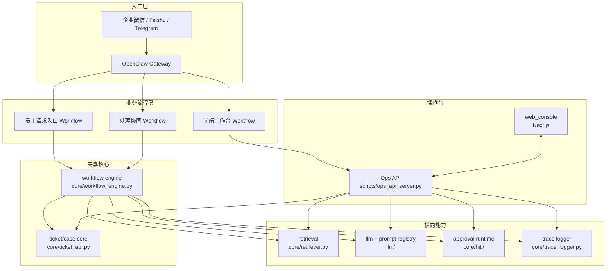
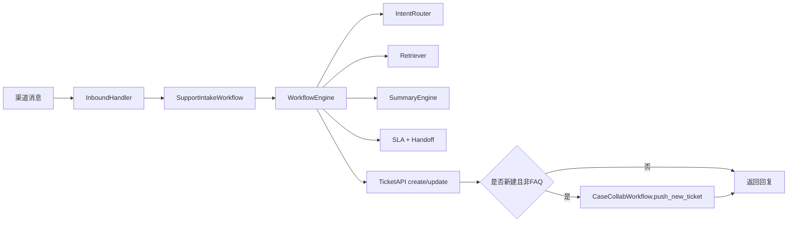
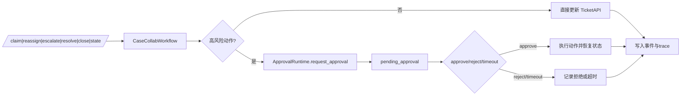
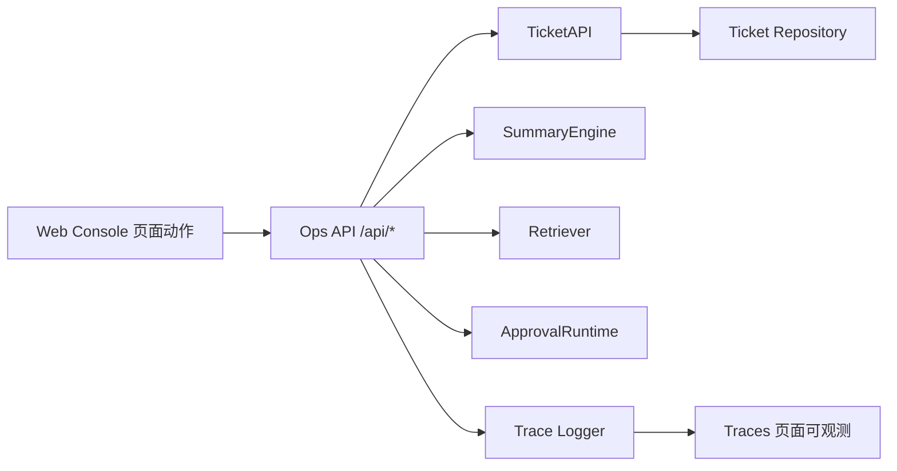
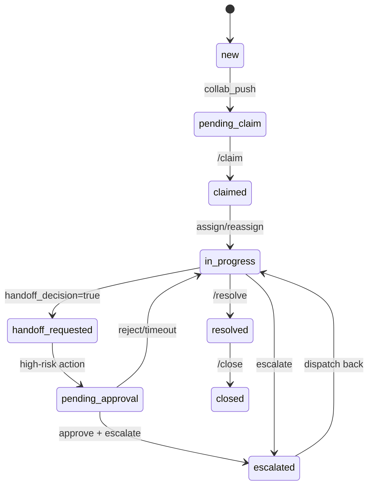

# ARCHITECTURE

**版本：v0.3.0（2026-03-12）**

本文档描述当前代码已落地的系统架构，不包含未实现设想。

## 1. 设计原则

1. **Workflow-first**：建单、状态流转、SLA、handoff、审批由确定性流程和规则控制。
2. **Agent-assisted**：在关键节点使用 Agent 能力提升分类、摘要、检索、建议质量。
3. **Gateway boundary**：OpenClaw 仅负责 ingress/session/routing，不承载 ticket 业务规则。
4. **HITL for high-risk**：高风险动作必须进入审批闸门，可暂停、可恢复、可审计。

## 2. 系统总架构

### 图1：系统总架构图

说明：入口层与业务层分离；三个工作流共享同一套 ticket/case core；retrieval/llm/hitl/trace 作为横向能力复用。



## 3. Ticket/Case Core

`core/ticket_api.py` 是生命周期规则中心，核心职责：

1. 管理状态机转移（`open/pending/escalated/handoff/resolved/closed`）。
2. 统一事件写入（`ticket_created/ticket_assigned/ticket_closed/...`）。
3. 执行 guardrail（禁止 closed 后继续更新）。
4. 与 `storage/ticket_repository.py`、`openclaw_adapter/session_mapper.py` 协作。

## 4. 三个工作流如何共享同一套核心

1. `SupportIntakeWorkflow`：入口消息转 ticket/outcome，复用 `WorkflowEngine + TicketAPI + Retriever + SummaryEngine`。
2. `CaseCollabWorkflow`：协同命令更新工单，复用 `TicketAPI + ApprovalRuntime`。
3. 前端工作台流程（Ops API + web_console）：通过 `/api/*` 调用同一 `TicketAPI/ApprovalRuntime/Retriever/SummaryEngine`。

结果：不管消息来自渠道还是前端页面，都落到同一套 ticket 与 trace 语义。

## 5. 三个工作流流程图

### 图2：员工请求入口工作流

说明：从入口消息到意图路由、检索、摘要、SLA/handoff，再到建单与协同推送。



### 图3：处理人员协同工作流

说明：协同命令进入 `CaseCollabWorkflow`，高风险动作进入审批，批准后恢复执行。



### 图4：前端工作台处理工作流

说明：Web Console 调用 Ops API，复用同一业务核心与审批能力。



## 6. 四个 Agent 在系统中的位置

### 图5：四个 Agent 分布图

说明：四个 Agent 共享同一条数据和审计主线，但服务不同角色。

```mermaid
flowchart TB
    I[Intake Agent\nSupportIntakeWorkflow]
    C[Case Copilot Agent\n/api/tickets/{id}/assist]
    O[Operator/Supervisor Agent\n/api/copilot/operator|queue/query]
    D[Dispatch/Collaboration Agent\nCaseCollabWorkflow + /api/copilot/dispatch/query]

    CORE[ticket/case core + trace + hitl + retrieval + llm]

    I --> CORE
    C --> CORE
    O --> CORE
    D --> CORE
```

## 7. retrieval / llm / hitl / trace / channels 关系

1. `channels`：入口规范化、签名校验、重放保护、重试观测（`openclaw_adapter/*`）。
2. `retrieval`：FAQ/SOP/history_case 检索与来源归因（`core/retriever.py` + `core/retrieval/*`）。
3. `llm`：摘要与提示词版本治理、provider fallback、trace metadata（`llm/*`）。
4. `hitl`：审批请求、决策、超时与恢复执行（`core/hitl/*`）。
5. `trace`：全链路事件（ingress/tool/summary/sla/handoff/approval）。

关系是“同一 ticket 主线上的横切能力层”，不是彼此独立的 sidecar。

## 8. OpenClaw Gateway 职责边界

OpenClaw Gateway 在代码层明确遵循：

- `openclaw_adapter/gateway.py`：只做 ingress/session/routing 与回发。
- `openclaw_adapter/inbound_handler.py`：签名校验、session 绑定、replay guard。
- `openclaw_adapter/outbound_sender.py`：重试决策与 egress trace。

不做：ticket 规则、SLA判断、审批决策、生命周期控制。

## 9. 状态机

### 图6：跨域状态机图（ticket.status + handoff_state）

说明：`new/claimed/in_progress/...` 是跨字段视图；底层落在 `ticket.status`、`handoff_state`、`lifecycle_stage` 三组字段。



## 10. 为什么不做 Fully Autonomous Agent

1. 工单系统有强约束对象：SLA、责任归属、升级与关闭合规要求。
2. 需要可审计链路：每个关键动作都要追溯触发人、触发规则、上下文证据。
3. 需要可恢复：审批挂起后可恢复执行，拒绝后可安全回退。

因此本项目不采用 autonomy-first，而是 workflow-first + agent-assisted。

## 11. 为什么高风险动作保留 HITL

1. 升级动作默认走审批（`approval_policy.py`）。
2. 敏感改派走审批（目标队列/目标责任人命中敏感规则时）。
3. 审批对象支持 `approved/rejected/timeout`，并写入 timeline + trace。
4. 保障业务控制权仍在人，不在模型。
