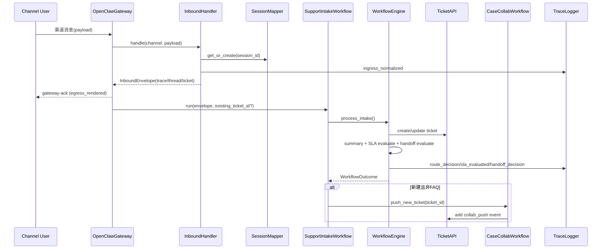

# ARCHITECTURE

## 1. 系统边界

本系统遵循 `workflow-first, agent-assisted` 设计：

- 业务主干在内部工作流和规则引擎：建单、状态流转、SLA、handoff、协同命令。
- Agent/LLM 仅增强节点质量：意图识别、检索、摘要、推荐动作。
- OpenClaw 仅提供 `ingress/session/routing` 能力，不处理业务规则。
- 当前范围不包含前端后台。

## 2. 模块关系

### 2.1 接入层

- `channel_adapters/*`：渠道 payload 标准化。
- `openclaw_adapter/inbound_handler.py`：将原始 payload 转换为 `InboundEnvelope`，补充 `trace_id/thread_id/ticket_id`。
- `openclaw_adapter/session_mapper.py`：维护 `session_id -> thread_id/ticket_id` 映射。
- `openclaw_adapter/gateway.py`：入口接收与回发封装，记录 ingress/egress trace。

### 2.2 业务工作流层

- `workflows/support_intake_workflow.py`（Workflow A）
  - 入口消息 -> workflow 引擎 -> FAQ 回复或自动建单 -> 按条件推送协同。
- `workflows/case_collab_workflow.py`（Workflow B）
  - 支持 `/claim`、`/reassign`、`/escalate`、`/close`。

### 2.3 核心引擎层

- `core/workflow_engine.py`：核心编排器，串联 intent、tool、ticket、summary、SLA、handoff。
- `core/ticket_api.py` + `storage/ticket_repository.py`：工单与事件落库。
- `core/trace_logger.py`：结构化事件日志，支持 trace/ticket/session 检索。

### 2.4 数据与可观测

- `storage/tickets.db`：SQLite 数据库（ticket/event/session binding）。
- `storage/gateway-dev.log`：JSON lines trace 日志。

## 3. 关键时序

### 3.1 消息入口 -> 工单 -> 协同 -> handoff/SLA

### 3.2 协同命令路径（Workflow B）

- `/claim`：设置 assignee 并记录 `collab_claim`。
- `/reassign <user>`：转派并记录 `collab_reassign`。
- `/escalate <reason>`：升级并记录 `collab_escalate`。
- `/close <note>`：闭环并记录 `collab_close`。

## 4. 设计约束与非目标

- 不把 OpenClaw 作为业务引擎。
- 不实现 autonomy-first 的无约束自循环。
- 不在当前阶段实现前端后台。
- 不交付无测试改动。
