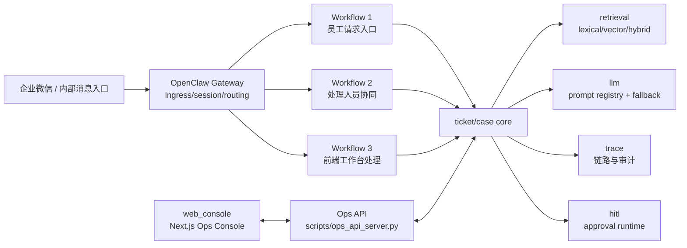

# support-agent-platform

**版本：v0.3.0（2026-03-12）**

`support-agent-platform` 是一个面向内部服务台场景的 **workflow-first, agent-assisted** 工单平台：
主干由可审计工作流驱动，Agent 能力嵌入关键节点做增强，而不是放任自治决策。

## 一句话定位

一个把“多渠道报修入口、工单流转、协同处理、运营工作台、AI辅助”收敛到同一套 ticket core 的内部支持平台。

## 解决的业务问题

这个系统针对以下高频痛点设计：

1. 消息入口分散：企业微信/内部渠道消息进入后，难统一到一个可追踪工单主线。
2. 处理过程不透明：谁认领、谁转派、为何升级、是否超 SLA，缺少统一视图。
3. 重复判断成本高：相同问题反复人工检索 FAQ/SOP/历史案例，效率低。
4. 用户追问难恢复上下文：多轮沟通后难快速回放已发生动作与证据来源。
5. 内部协同链条割裂：处理群、工单系统、前端工作台之间状态不一致。

## 面向角色

- 员工/内部用户：发起报修、咨询、投诉，获得回执。
- 一线处理人员：认领、转派、升级、解决、关闭工单。
- 值班/主管：监控队列、SLA风险、审批高风险动作。
- 运维/平台工程：排查网关链路、trace、replay、可靠性指标。

## 为什么是 Workflow-First, Agent-Assisted

- 不是纯工作流：分类、摘要、检索、推荐动作、运营问答、协同问答等节点引入 Agent 能力，提高处理质量与速度。
- 不是完全自治 Agent：工单生命周期、SLA、handoff、resolve/close、审批是高约束流程，必须可控、可审计、可恢复。
- 设计选择：**确定性流程控制高风险动作，Agent 负责认知增强与建议生成**。

## 为什么 OpenClaw 只做 ingress/session/routing

OpenClaw 在本项目中是入口层，不是业务规则层。

- 负责：渠道接入、会话绑定、路由、回发、签名与重放防护、重试观测。
- 不负责：ticket 生命周期决策、SLA判定、handoff规则、审批策略。
- 业务主干落在：`core/` + `workflows/` + `scripts/ops_api_server.py`。

这条边界在代码中是硬约束（见 `openclaw_adapter/gateway.py` 注释与实现）。

## 系统总览

### 图1：系统总架构图

说明：企业微信/内部消息入口先进入 OpenClaw Gateway，再进入三个工作流；三条工作流共享同一套 ticket/case core，并复用 retrieval、llm、trace、hitl 能力；Web Console 通过 Ops API 参与处理。



## 三个工作流

### Workflow 1：员工请求入口工作流（Support Intake）

- 目标：把入口消息转成可追踪 ticket，并输出可执行回复。
- 角色：员工/内部用户。
- 输入：渠道消息（报修/咨询/投诉等）。
- 输出：FAQ直答或建单回执；必要时触发 handoff 与协同推送。
- 状态：`open/pending/handoff/escalated/resolved/closed`（ticket.status）+ `pending_claim/pending_approval/...`（handoff_state）。
- 页面支持：Dashboard、Tickets、Ticket Detail、Timeline。
- API支持：入口为渠道 webhook -> OpenClaw -> `SupportIntakeWorkflow`；工单查询通过 `/api/tickets`、`/api/tickets/{id}`、`/api/tickets/{id}/events`。

### Workflow 2：处理人员协同工作流（Case Collaboration）

- 目标：让处理人员在协同场景下完成认领/转派/升级/解决/关闭。
- 角色：客服、维修、值班同学。
- 输入：`/claim /reassign /escalate /resolve /close /state`。
- 输出：工单状态更新、审批挂起或恢复、事件审计。
- 状态：`pending_claim`、`claimed`、`waiting_customer`、`waiting_internal`、`pending_approval`、`escalated`、`resolved`、`closed`、`completed`。
- 页面支持：Queues、Tickets、Ticket Detail、Channels。
- API支持：`POST /api/tickets/{id}/claim|reassign|escalate|resolve|close`，`GET /api/approvals/pending`，`POST /api/approvals/{id}/approve|reject`。

### Workflow 3：前端工作台处理工作流（Ops Console）

- 目标：在统一工作台完成正式处理、监控与知识维护。
- 角色：客服、运营、主管。
- 输入：页面动作（筛选、查看、处理、审批、KB CRUD、trace drill-down）。
- 输出：处理结果、队列监控、知识更新、链路解释。
- 状态：与 ticket/status + handoff_state 同步。
- 页面支持：Dashboard、Tickets、Ticket Detail、Traces、Queues、KB、Channels。
- API支持：`/api/dashboard/*`、`/api/tickets*`、`/api/traces*`、`/api/queues*`、`/api/kb*`、`/api/channels*`、`/api/openclaw*`、`/api/copilot/*`。

## 四个 Agent

> 这里的 “Agent” 指“具备上下文理解 + 工具编排/检索 + 输出建议 + trace可追踪”的能力单元，不是简单 if/else 函数。

### 1) Intake Agent

- 目标：完成入口理解、检索与建单建议。
- 位置：`workflows/support_intake_workflow.py` + `core/workflow_engine.py`。
- 主要工具：`IntentRouter`、`Retriever`、`SummaryEngine`、`TicketAPI`、`ToolRouter`。
- 输入输出：入口消息 -> ticket/reply/recommendations/handoff decision。
- 边界：不直接绕过工单规则做高风险终态动作。

### 2) Case Copilot Agent

- 目标：为单工单提供摘要、推荐动作、相似案例、grounding。
- 位置：`/api/tickets/{id}/assist`、`/similar-cases`、`/grounding-sources`。
- 主要工具：`SummaryEngine`、`Retriever`、`RecommendedActionsEngine`。
- 输入输出：ticket + events -> assist payload + llm trace。
- 边界：输出建议，不直接执行敏感动作。

### 3) Operator / Supervisor Agent

- 目标：回答运营视角问题（队列压力、SLA风险、优先级建议）。
- 位置：`/api/copilot/operator/query`、`/api/copilot/queue/query`。
- 主要工具：队列聚合、dashboard summary、grounding 检索。
- 输入输出：运营问题 -> 风险与优先处理建议。
- 边界：当前实现为规则化回答 + grounding（`llm_trace.provider=fallback`），不直接改写工单。

### 4) Dispatch / Collaboration Agent

- 目标：支持协同调度问答与内部分配建议。
- 位置：`/api/copilot/dispatch/query` + `CaseCollabWorkflow`。
- 主要工具：队列汇总、风险排序、协同命令处理。
- 输入输出：调度问题/命令 -> 优先队列建议/状态更新。
- 边界：高风险动作仍走审批闸门。

## 技术栈（以代码为准）

### 后端

- Python 3.11+（已接入）
- API层：`http.server` + `ThreadingHTTPServer`（已接入，当前不是 FastAPI）
- 配置：TOML + `.env` + secrets loader（已接入）
- 存储：SQLite + repository/migrations（已接入）

### AI 与检索

- LLM provider：OpenAI-compatible provider + fallback router（已接入）
- Prompt Registry：`prompt_key/prompt_version/scenario/expected_schema`（已接入）
- LLM trace：provider/model/prompt_version/latency/retry/token_usage（已接入）
- Retrieval：lexical/vector/hybrid + rerank + source attribution（已接入）

### 接入与网关

- OpenClaw adapter：ingress/session/routing（已接入）
- signature/replay guard/retry observability（已接入）
- WeCom bridge server（已接入）

### 前端

- `web_console`：Next.js 15 + React 19 + TypeScript + Vitest（已接入）

### 测试与CI

- Python：pytest + ruff + mypy + Make quality gates（已接入）
- Frontend：eslint + tsc + vitest（已接入）
- CI：GitHub Actions（quality + container smoke + acceptance）（已接入）

## 快速启动

### 1) 后端环境

```bash
cd support-agent-platform
python -m venv .venv
source .venv/bin/activate
pip install -e ".[dev]"
cp .env.example .env
export SUPPORT_AGENT_ENV=dev
```

### 2) 启动 Ops API

```bash
python -m scripts.ops_api_server --env dev --host 127.0.0.1 --port 18082
# 开发调试可加热重载（代码变更自动重启）
# python -m scripts.ops_api_server --env dev --host 127.0.0.1 --port 18082 --reload
```

### 3) 启动企业微信 bridge（可选）

```bash
python -m scripts.wecom_bridge_server --env dev --host 127.0.0.1 --port 18081
# 开发调试可加热重载（代码变更自动重启）
# python -m scripts.wecom_bridge_server --env dev --host 127.0.0.1 --port 18081 --reload
```

### 4) 启动前端

```bash
cd web_console
npm install
npm run dev
```

### 5) 常用重启命令（前端 / 后端 / 网关）

> 说明：本地默认是嵌入式 Gateway，随 `Ops API` 进程一起重启；企业微信桥接服务为 `wecom_bridge_server`。
> 若希望开发期自动重载，请使用前台 `--reload` 模式，不建议与 `nohup` 混用。

```bash
# 在仓库根目录 support-agent-platform 执行
mkdir -p logs

# 0) WeCom 群聊与派发目标（2026-03-14 已核验）
# 工单处理群 chatid: wrAEX9RgAAKNkRjmFs6f3f2z_tEPiT1A
# 故障处理群 chatid: wrAEX9RgAAEuFUL3vLamRkD6m8MtU6bQ
# 当前默认派发到“工单处理群”

# 1) 重启后端 Ops API
pkill -f "python -m scripts.ops_api_server" || true
nohup python -m scripts.ops_api_server --env dev --host 127.0.0.1 --port 18082 > logs/ops_api_server.log 2>&1 &

# 2) 重启网关桥接（WeCom bridge）
pkill -f "python -m scripts.wecom_bridge_server" || true
export WECOM_DISPATCH_TARGETS_JSON='{"queue:human-handoff":"group:wrAEX9RgAAKNkRjmFs6f3f2z_tEPiT1A:user:u_dispatch_bot","inbox:wecom.default":"group:wrAEX9RgAAKNkRjmFs6f3f2z_tEPiT1A:user:u_dispatch_bot","default":"group:wrAEX9RgAAKNkRjmFs6f3f2z_tEPiT1A:user:u_dispatch_bot"}'
nohup python -m scripts.wecom_bridge_server --env dev --host 127.0.0.1 --port 18081 > logs/wecom_bridge_server.log 2>&1 &

# 3) 重启前端
pkill -f "next dev --hostname 0.0.0.0 --port 3000" || true
(cd web_console && nohup npm run dev -- --hostname 0.0.0.0 --port 3000 > ../logs/web_console_dev.log 2>&1 &)

# 4) 健康检查
curl http://127.0.0.1:18082/healthz
curl http://127.0.0.1:18081/healthz
curl -I http://127.0.0.1:3000
```

若你使用外部 OpenClaw profile，请按本机 OpenClaw 安装方式重启对应 profile。

## 主要目录说明

- `core/`：ticket lifecycle、intent/tool/handoff/sla/recommendation、trace、hitl。
- `workflows/`：`SupportIntakeWorkflow`、`CaseCollabWorkflow`、链路组合。
- `llm/`：provider、fallback、prompt registry、eval。
- `openclaw_adapter/`：gateway、session mapper、signature/replay/retry、channel routing。
- `scripts/`：ops api、bridge、replay、trace debug、acceptance/release 脚本。
- `storage/`：SQLite 模型、仓储、迁移与产物目录。
- `tests/`：unit/workflow/integration/regression。
- `web_console/`：Ops Console 页面、组件、API 客户端、前端测试。
- `seed_data/`：FAQ/SOP/history_case、SLA规则、acceptance样本。

## 关键页面

- `/`：Dashboard（运营概览）
- `/tickets`：工单列表
- `/tickets/[ticketId]`：工单详情 + 时间线 + AI Assist
- `/traces`：链路列表
- `/traces/[traceId]`：链路详情
- `/queues`：队列视图
- `/kb/faq`、`/kb/sop`、`/kb/cases`：知识库管理
- `/channels`：渠道与 OpenClaw 可靠性观察

## 演示链路（员工报修 -> 建单 -> 协同 -> 前端处理 -> 进度查询）

1. 员工报修：
   `python scripts/replay_gateway_event.py --env dev --channel wecom --session-id demo-u1 --text "停车场抬杆故障" --trace-id trace_demo_u1`
2. 建单确认：
   `curl "http://127.0.0.1:18082/api/tickets?page=1&page_size=20"`
3. 协同处理：
   `POST /api/tickets/{ticket_id}/claim` -> `.../escalate`（会触发审批挂起）
4. 前端处理：
   在 `web_console` 打开 Ticket Detail、Queues、Approvals 完成审批与动作。
5. 进度查询：
   使用 `GET /api/tickets/{ticket_id}` / `/events` 查看状态演进；
   员工侧同会话追问已接入 `progress_query` 意图与自然语言回复（LLM优先、规则兜底）。

## 当前版本能力边界（明确不做）

1. 不做 fully autonomous multi-agent planner。
2. 不让 OpenClaw 承载 ticket 业务决策。
3. 不提供多租户/RBAC/复杂组织权限体系。
4. 不提供分布式多写存储（当前为 SQLite 单实例形态）。
5. 不承诺跨会话自动关联历史工单；当前进度查询基于会话绑定 `ticket_id` 或显式工单号。

## 文档索引

- [ARCHITECTURE.md](./ARCHITECTURE.md)
- [RUNBOOK.md](./RUNBOOK.md)
- [EVAL.md](./EVAL.md)
- [CHANGELOG.md](./CHANGELOG.md)
- [RELEASE_NOTES.md](./RELEASE_NOTES.md)
- [UPGRADE3_FINAL.md](./UPGRADE3_FINAL.md)
