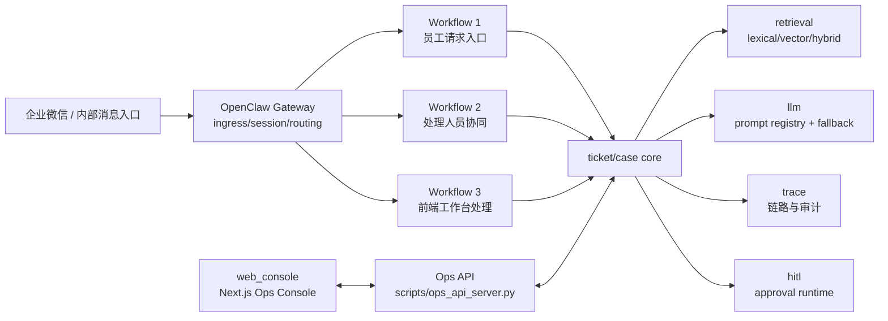

# support-agent-platform

**版本：v0.3.0（2026-03-12）**

`support-agent-platform` 是一个面向内部服务台场景的 **workflow-first, agent-assisted** 工单平台：
主干由可审计工作流驱动，Agent 能力嵌入关键节点做增强，而不是放任自治决策。

## 一句话定位

一个把"多渠道报修入口、工单流转、协同处理、运营工作台、AI辅助"收敛到同一套 ticket core 的内部支持平台。

## 解决的业务痛点

这个系统针对以下高频痛点设计：

### 1. 消息入口分散
- **痛点**：企业微信/飞书/钉钉/内部渠道消息进入后，难统一到一个可追踪工单主线
- **解决**：多渠道统一接入层（OpenClaw Gateway），所有入口消息自动转为可追踪 ticket

### 2. 处理过程不透明
- **痛点**：谁认领、谁转派、为何升级、是否超 SLA，缺少统一视图
- **解决**：完整工单生命周期状态机 + Timeline 审计 + SLA 预警/超时监控

### 3. 重复判断成本高
- **痛点**：相同问题反复人工检索 FAQ/SOP/历史案例，效率低
- **解决**：AI 入口分流（FAQ 直答）+ 相似案例推荐 + 智能摘要生成

### 4. 用户追问难恢复上下文
- **痛点**：多轮沟通后难快速回放已发生动作与证据来源
- **解决**：完整事件时间线 + Trace 链路追踪 + Grounding 证据溯源

### 5. 内部协同链条割裂
- **痛点**：处理群、工单系统、前端工作台之间状态不一致
- **解决**：统一工单核心 + 协同工作流 + 实时同步的处理状态

### 6. 高风险操作缺乏审批
- **痛点**：转派、升级等敏感操作缺少审批机制，难以追溯
- **解决**：HITL（Human-In-The-Loop）审批流，高风险动作必须审批后执行

### 7. 知识维护成本高
- **痛点**：FAQ/SOP/历史案例散落各处，更新不及时
- **解决**：统一知识库管理（FAQ/SOP/历史案例）+ AI 辅助检索

### 8. 运营数据不透明
- **痛点**：无法快速了解队列压力、SLA 风险、处理效率
- **解决**：运营 Dashboard + 队列监控 + 实时指标看板

## 核心功能特性

### 多渠道统一接入
- 支持企业微信、飞书、钉钉等渠道
- OpenClaw Gateway 统一入口、会话绑定、路由分发
- 签名验证、重放防护、 retry 观测

### 智能工单处理
- AI 入口分流：自动识别 FAQ 直答还是建单
- 相似案例推荐：减少重复处理
- 智能摘要：快速了解工单上下文
- 推荐动作：AI 建议下一步操作

### 完整工作流
- **员工请求入口**：消息 → 理解 → 检索 → 建单/回复
- **处理人员协同**：认领 → 转派 → 升级 → 解决 → 关闭
- **前端工作台处理**：筛选 → 查看 → 处理 → 审批 → 知识维护

### 可观测性
- 全链路 Trace：每个请求完整追踪
- SLA 监控：预警/超时实时提醒
- Channel 健康度：各渠道接入状态监控

### 审批与合规
- HITL 审批流：高风险动作必须审批
- 完整审计日志：所有操作可追溯

## 面向角色

- 员工/内部用户：发起报修、咨询、投诉，获得回执。
- 一线处理人员：认领、转派、升级、解决、关闭工单。
- 值班/主管：监控队列、SLA风险、审批高风险动作。
- 运维/平台工程：排查网关链路、trace、replay、可靠性指标。

## 为什么是 Workflow-First, Agent-Assisted

- 不是纯工作流：分类、摘要、检索、推荐动作、运营问答、协同问答等节点引入 Agent 能力，提高处理质量与速度。
- 不是完全自治 Agent：工单生命周期、SLA、handoff、resolve/close、审批是高约束流程，必须可控、可审计、可恢复。
- 设计选择：**确定性流程控制高风险动作，Agent 负责认知增强与建议生成**。

## 为什么 OpenClaw 只做 ingress/session/routing

OpenClaw 在本项目中是入口层，不是业务规则层。

- 负责：渠道接入、会话绑定、路由、回发、签名与重放防护、重试观测。
- 不负责：ticket 生命周期决策、SLA判定、handoff规则、审批策略。
- 业务主干落在：`core/` + `workflows/` + `scripts/ops_api_server.py`。

这条边界在代码中是硬约束（见 `openclaw_adapter/gateway.py` 注释与实现）。

## 系统总览

### 图1：系统总架构图

说明：企业微信/内部消息入口先进入 OpenClaw Gateway，再进入三个工作流；三条工作流共享同一套 ticket/case core，并复用 retrieval、llm、trace、hitl 能力；Web Console 通过 Ops API 参与处理。



## 三个工作流

### Workflow 1：员工请求入口工作流（Support Intake）

- 目标：把入口消息转成可追踪 ticket，并输出可执行回复。
- 角色：员工/内部用户。
- 输入：渠道消息（报修/咨询/投诉等）。
- 输出：FAQ直答或建单回执；必要时触发 handoff 与协同推送。
- 状态：`open/pending/handoff/escalated/resolved/closed`（ticket.status）+ `pending_claim/pending_approval/...`（handoff_state）。
- 页面支持：Dashboard、Tickets、Ticket Detail、Timeline。
- API支持：入口为渠道 webhook -> OpenClaw -> `SupportIntakeWorkflow`；工单查询通过 `/api/tickets`、`/api/tickets/{id}`、`/api/tickets/{id}/events`。

### Workflow 2：处理人员协同工作流（Case Collaboration）

- 目标：让处理人员在协同场景下完成认领/转派/升级/解决/关闭。
- 角色：客服、维修、值班同学。
- 输入：`/claim /reassign /escalate /resolve /close /state`。
- 输出：工单状态更新、审批挂起或恢复、事件审计。
- 状态：`pending_claim`、`claimed`、`waiting_customer`、`waiting_internal`、`pending_approval`、`escalated`、`resolved`、`closed`、`completed`。
- 页面支持：Queues、Tickets、Ticket Detail、Channels。
- API支持：`POST /api/tickets/{id}/claim|reassign|escalate|resolve|close`，`GET /api/approvals/pending`，`POST /api/approvals/{id}/approve|reject`。

### Workflow 3：前端工作台处理工作流（Ops Console）

- 目标：在统一工作台完成正式处理、监控与知识维护。
- 角色：客服、运营、主管。
- 输入：页面动作（筛选、查看、处理、审批、KB CRUD、trace drill-down）。
- 输出：处理结果、队列监控、知识更新、链路解释。
- 状态：与 ticket/status + handoff_state 同步。
- 页面支持：Dashboard、Tickets、Ticket Detail、Traces、Queues、KB、Channels。
- API支持：`/api/dashboard/*`、`/api/tickets*`、`/api/traces*`、`/api/queues*`、`/api/kb*`、`/api/channels*`、`/api/openclaw*`、`/api/copilot/*`。

### Upgrade 5：人工接管私聊闭环（Reply Workspace）

- 前端在 Ticket Detail 新增 `Reply Workspace`：`AI 草稿 -> 人工编辑 -> 人工确认发送`。
- 新增后端接口：
  - `POST /api/v2/tickets/{ticketId}/reply-draft`
  - `POST /api/v2/tickets/{ticketId}/reply-send`
- `reply-send` 约束：
  - `advice_only` 只用于建议，不会自动外发
  - 必须人工确认后发送
  - 观察者（observer）禁止发送
  - `idempotency_key` 防重复发送
- 发送审计与可观测：
  - `reply_draft_generated`
  - `reply_send_requested`
  - `reply_send_delivered`
  - `reply_send_failed`
  - `reply_send_retry_scheduled`
  - `reply_send_dedup_hit`
- 前端可通过 `GET /api/tickets/{ticketId}/reply-events` 查看发送链路，并可 drill-down 到对应 trace。

## 四个 Agent

> 这里的 “Agent” 指“具备上下文理解 + 工具编排/检索 + 输出建议 + trace可追踪”的能力单元，不是简单 if/else 函数。

### 1) Intake Agent

- 目标：完成入口理解、检索与建单建议。
- 位置：`workflows/support_intake_workflow.py` + `core/workflow_engine.py`。
- 主要工具：`IntentRouter`、`Retriever`、`SummaryEngine`、`TicketAPI`、`ToolRouter`。
- 输入输出：入口消息 -> ticket/reply/recommendations/handoff decision。
- 边界：不直接绕过工单规则做高风险终态动作。

### 2) Case Copilot Agent

- 目标：为单工单提供摘要、推荐动作、相似案例、grounding。
- 位置：`/api/tickets/{id}/assist`、`/similar-cases`、`/grounding-sources`。
- 主要工具：`SummaryEngine`、`Retriever`、`RecommendedActionsEngine`。
- 输入输出：ticket + events -> assist payload + llm trace。
- 边界：输出建议，不直接执行敏感动作。

### 3) Operator / Supervisor Agent

- 目标：回答运营视角问题（队列压力、SLA风险、优先级建议）。
- 位置：`/api/copilot/operator/query`、`/api/copilot/queue/query`。
- 主要工具：队列聚合、dashboard summary、grounding 检索。
- 输入输出：运营问题 -> 风险与优先处理建议。
- 边界：当前实现为规则化回答 + grounding（`llm_trace.provider=fallback`），不直接改写工单。

### 4) Dispatch / Collaboration Agent

- 目标：支持协同调度问答与内部分配建议。
- 位置：`/api/copilot/dispatch/query` + `CaseCollabWorkflow`。
- 主要工具：队列汇总、风险排序、协同命令处理。
- 输入输出：调度问题/命令 -> 优先队列建议/状态更新。
- 边界：高风险动作仍走审批闸门。

## 技术栈（以代码为准）

### 后端

- Python 3.11+（已接入）
- API层：`http.server` + `ThreadingHTTPServer`（已接入，当前不是 FastAPI）
- 配置：TOML + `.env` + secrets loader（已接入）
- 存储：SQLite + repository/migrations（已接入）

### AI 与检索

- LLM provider：OpenAI-compatible provider + fallback router（已接入）
- Prompt Registry：`prompt_key/prompt_version/scenario/expected_schema`（已接入）
- LLM trace：provider/model/prompt_version/latency/retry/token_usage（已接入）
- Retrieval：lexical/vector/hybrid + rerank + source attribution（已接入）

### 接入与网关

- OpenClaw adapter：ingress/session/routing（已接入）
- signature/replay guard/retry observability（已接入）
- WeCom bridge server（已接入）

### 前端

- `web_console`：Next.js 15 + React 19 + TypeScript + Vitest（已接入）

### 测试与CI

- Python：pytest + ruff + mypy + Make quality gates（已接入）
- Frontend：eslint + tsc + vitest（已接入）
- CI：GitHub Actions（quality + container smoke + acceptance）（已接入）

## 快速启动

### 1) 后端环境

```bash
cd support-agent-platform
python -m venv .venv
source .venv/bin/activate
pip install -e ".[dev]"
cp .env.example .env
export SUPPORT_AGENT_ENV=dev
```

### 2) 启动 Ops API

```bash
python -m scripts.ops_api_server --env dev --host 127.0.0.1 --port 18082
# 开发调试可加热重载（代码变更自动重启）
# python -m scripts.ops_api_server --env dev --host 127.0.0.1 --port 18082 --reload
```

### 3) 启动企业微信 bridge（可选）

```bash
python -m scripts.wecom_bridge_server --env dev --host 127.0.0.1 --port 18081
# 开发调试可加热重载（代码变更自动重启）
# python -m scripts.wecom_bridge_server --env dev --host 127.0.0.1 --port 18081 --reload
```

### 4) 启动前端

```bash
cd web_console
npm install
npm run dev
```

## 完整命令参考

### Makefile 命令（项目根目录）

```bash
# 代码质量
make format          # 代码格式化 (ruff format)
make lint            # 代码检查 (ruff check)
make typecheck       # 类型检查 (mypy)
make validate-structure  # 目录结构校验

# 测试
make test            # 运行所有测试
make test-unit       # 单元测试
make test-workflow   # 工作流测试
make test-regression # 回归测试
make test-integration # 集成测试
make smoke-replay    # Gateway 冒烟测试

# 验收与部署
make acceptance           # 运行验收测试
make acceptance-gate      # 验收 + Trace KPI
make trace-kpi            # 生成 Trace KPI 报告
make ci                   # CI 完整检查 (validate-structure + lint + typecheck + 所有测试)
make check                # 本地快速检查

# 部署相关
make deploy-release       # 部署发布
make verify-release       # 验证发布
make rollback-release     # 回滚发布
make container-smoke      # Docker 容器冒烟测试

# 环境变量
make deploy-release ENV=prod   # 指定环境部署
```

### 前端命令（web_console 目录）

```bash
# 开发
npm run dev              # 启动开发服务器 (localhost:3000)
npm run build            # 生产构建
npm run start            # 启动生产服务器

# 测试与质量
npm run test             # 运行测试 (vitest)
npm run lint             # ESLint 检查
npm run typecheck        # TypeScript 类型检查
```

### 常用脚本命令

```bash
# 事件重放（模拟用户请求）
python -m scripts.replay_gateway_event.py --env dev --channel wecom --session-id demo-u1 --text "停车场抬杆故障" --trace-id trace_demo_u1

# Gateway 状态查询
python -m scripts.gateway_status --env dev

# Trace 调试
python -m scripts.trace_debug --env dev --trace-id <trace_id>

# 健康检查
python -m scripts.healthcheck --env dev

# 验收测试
python -m scripts.run_acceptance --env dev

# Trace KPI 分析
python -m scripts.trace_kpi --env dev --output storage/acceptance/trace_kpi_from_log.json

# 发布相关
python -m scripts.deploy_release --env dev
python -m scripts.verify_release --env dev --require-active-release
python -m scripts.rollback_release --env dev
```

### 常用重启命令（前端 / 后端 / 网关）

> 说明：本地默认是嵌入式 Gateway，随 `Ops API` 进程一起重启；企业微信桥接服务为 `wecom_bridge_server`。
> 若希望开发期自动重载，请使用前台 `--reload` 模式，不建议与 `nohup` 混用。

```bash
# 在仓库根目录 support-agent-platform 执行
mkdir -p logs

# 0) WeCom 群聊与派发目标（2026-03-14 已核验）
# 工单处理群 chatid: wrAEX9RgAAKNkRjmFs6f3f2z_tEPiT1A
# 故障处理群 chatid: wrAEX9RgAAEuFUL3vLamRkD6m8MtU6bQ
# 当前默认派发到"工单处理群"

# 1) 重启后端 Ops API
pkill -f "python -m scripts.ops_api_server" || true
nohup python -m scripts.ops_api_server --env dev --host 127.0.0.1 --port 18082 > logs/ops_api_server.log 2>&1 &

# 2) 重启网关桥接（WeCom bridge）
pkill -f "python -m scripts.wecom_bridge_server" || true
export WECOM_DISPATCH_TARGETS_JSON='{"queue:human-handoff":"group:wrAEX9RgAAKNkRjmFs6f3f2z_tEPiT1A:user:u_dispatch_bot","inbox:wecom.default":"group:wrAEX9RgAAKNkRjmFs6f3f2z_tEPiT1A:user:u_dispatch_bot","default":"group:wrAEX9RgAAKNkRjmFs6f3f2z_tEPiT1A:user:u_dispatch_bot"}'
nohup python -m scripts.wecom_bridge_server --env dev --host 127.0.0.1 --port 18081 > logs/wecom_bridge_server.log 2>&1 &

# 3) 重启前端
pkill -f "next dev --hostname 0.0.0.0 --port 3000" || true
(cd web_console && nohup npm run dev -- --hostname 0.0.0.0 --port 3000 > ../logs/web_console_dev.log 2>&1 &)

# 4) 健康检查
curl http://127.0.0.1:18082/healthz
curl http://127.0.0.1:18081/healthz
curl -I http://127.0.0.1:3000
```

### 服务端口说明

| 服务 | 端口 | 说明 |
|------|------|------|
| Ops API | 18082 | 主要业务 API 服务 |
| WeCom Bridge | 18081 | 企业微信消息桥接 |
| Web Console | 3000 | 前端开发/生产服务 |

## 企业微信（WeCom）相关命令与配置

### 环境变量配置

```bash
# 派发目标配置（必填）
export WECOM_DISPATCH_TARGETS_JSON='{"inbox:wecom.default":"group:wrAEX9RgAAKNkRjmFs6f3f2z_tEPiT1A:user:u_dispatch_bot"}'

# 自动派发开关（默认开启；设为 0/false/off 可关闭）
export WECOM_DISPATCH_AUTO_ENABLED=1

# 长消息分段阈值（默认1200字符）
export WECOM_BRIDGE_OUTBOUND_CHUNK_CHARS=1200

# 群聊模板去重窗口（默认60秒，设为0关闭）
export WECOM_GROUP_TEMPLATE_DEDUP_WINDOW_SECONDS=60

# 私聊详情异步发送（默认开启）
export WECOM_GROUP_PRIVATE_DETAIL_ASYNC=1

# 真实 API 发送（默认关闭，仅渲染不投递）
export WECOM_APP_API_ENABLED=1
export WECOM_CORP_ID=wwd783420586740f2d
export WECOM_AGENT_ID=1000044
export WECOM_AGENT_SECRET="$WECOM_AGENT_SECRET"
```

### WeCom 派发目标映射（Target Mapping）

`WECOM_DISPATCH_TARGETS_JSON` 支持的键优先级：
1. `queue:<queue_name>`
2. `inbox:<inbox_name>`
3. `<queue_name>`
4. `<inbox_name>`
5. `default`

值写法：
- `group:<group_id>:user:<actor_id>`（完整 session_id）
- `group:<group_id>`（自动补 `:user:u_dispatch_bot`）
- `<group_id>`（纯群 ID，自动补前缀）

### 企业微信协同命令

| 命令 | 何时可用 | 典型场景 | 示例 |
| --- | --- | --- | --- |
| `/new` | 当前会话中要切换到新问题 | 同一用户连续报修多个故障 | `/new` |
| `/end` | 当前会话要结束 | 本轮咨询结束 | `/end` |
| `/claim` | 处理群内、工单已存在 | 工程师接手工单 | `/claim TCK-123456` |
| `/resolve` | 工程师已处理完成 | 进入"待用户确认恢复" | `/resolve TCK-123456 已修复并复测正常` |
| `/customer-confirm` | 用户确认恢复 | 结束工单闭环 | `/customer-confirm TCK-123456` |
| `/operator-close` | 需要人工强制关闭 | 用户失联、重复单、误报等 | `/operator-close TCK-123456 用户失联 --confirm` |
| `/end-session` | 协同侧主动结束会话上下文 | 工单处理结束后清理会话态 | `/end-session TCK-123456 manual_end_session` |
| `/close` | 兼容命令 | 老命令平滑过渡 | `/close TCK-123456` |
| `/reopen` | 已关闭工单需要重开 | 复发故障重新处理 | `/reopen TCK-123456 复发 --confirm` |
| `/priority` | 调整优先级 | 升级/降级紧急度 | `/priority TCK-123456 P1` |
| `/status` | 查询工单状态 | 处理进度查询 | `/status TCK-123456` |
| `/list` | 查看工单列表 | 看 P1/P2、待处理等 | `/list TCK-123456 P1` |
| `/assign` | 指派处理人 | 直接指派负责人 | `/assign TCK-123456 Yusongze --confirm` |
| `/reassign` | 改派处理人 | 从 A 转派给 B | `/reassign TCK-123456 Yusongze --confirm` |
| `/needs-info` | 要求补充信息 | 信息不足需补充 | `/needs-info TCK-123456 请补楼层 --confirm` |
| `/escalate` | 升级处理 | 提升到更高支持级别 | `/escalate TCK-123456 影响面扩大 --confirm` |
| `/link` | 关联工单 | 两单关联追踪 | `/link TCK-123456 TCK-654321 --confirm` |
| `/merge` | 合并工单 | 重复单合并 | `/merge TCK-123456 TCK-654321 --confirm` |
| `/state` | 修改协同状态 | 更新 handoff_state | `/state TCK-123456 waiting_internal --confirm` |

**支持空格变体**：`/ claim TCK-xxx`、`/ resolve TCK-xxx 备注`

**支持中文自然语义**：
- `认领工单 TCK-xxx`、`我来处理 TCK-xxx` -> `claim`
- `已解决 TCK-xxx`、`处理完成 TCK-xxx` -> `resolve`

**高风险命令安全闸门**：
- 以下命令必须使用显式斜杠命令，且需要追加 `--confirm` 才会执行：`/operator-close`、`/assign`、`/reassign`、`/needs-info`、`/escalate`、`/merge`、`/link`、`/state`。
- 对于自然语言（如“人工关闭 TCK-xxx”），系统只给出可执行命令提示，不直接执行。

### WeCom 重放测试命令

```bash
# 模拟企业微信群消息（Dispatch Bridge 流程）
python -m scripts.replay_wecom_dispatch_bridge.py \
  --env dev \
  --sender-id u_report_user \
  --chat-id wrAEX9RgAAEuFUL3vLamRkD6m8MtU6bQ \
  --text "停车场抬杆故障" \
  --trace-id trace_wecom_dispatch_test

# 模拟企业微信用户消息（普通入口流程）
python -m scripts.replay_gateway_event.py \
  --env dev \
  --channel wecom \
  --session-id demo-u1 \
  --text "停车场抬杆故障" \
  --trace-id trace_demo_u1

# 50 组合生命周期回放（命令映射 + 安全闸门 + 状态校验）
python -m scripts.replay_wecom_lifecycle_matrix \
  --env dev \
  --customer-id keguonian \
  --operator-id Yusongze \
  --output artifacts/real_tests/wecom_lifecycle_matrix_report.json
```

### WeCom Bridge 推荐启动命令

```bash
cd /home/kkk/Project/support-agent-platform

PYTHONPATH=. \
WECOM_APP_API_ENABLED=1 \
WECOM_DISPATCH_AUTO_ENABLED=1 \
WECOM_CORP_ID=wwd783420586740f2d \
WECOM_AGENT_ID=1000044 \
WECOM_AGENT_SECRET="$WECOM_AGENT_SECRET" \
WECOM_DISPATCH_TARGETS_JSON='{"inbox:wecom.default":"group:wrAEX9RgAAKNkRjmFs6f3f2z_tEPiT1A:user:u_dispatch_bot"}' \
python scripts/wecom_bridge_server.py --env dev --host 0.0.0.0 --port 18081 --path /wecom/process
```

**配套群信息**：
- 故障维修群（上报入口）：`wrAEX9RgAAEuFUL3vLamRkD6m8MtU6bQ`
- 工单处理群（派工目标）：`wrAEX9RgAAKNkRjmFs6f3f2z_tEPiT1A`

### WeCom Trace 事件

- `wecom_dispatch_decision`：派发决策
- `wecom_dispatch_blocked`：派发阻断
- `wecom_dispatch_delivery`：派发投递结果
- `wecom_group_template_dedup_suppressed`：群聊模板去重
- `wecom_private_detail_async_scheduled`：私聊详情异步调度
- `wecom_private_detail_session_bound`：私聊详情会话绑定

## 主要目录说明

# 4) 健康检查
curl http://127.0.0.1:18082/healthz
curl http://127.0.0.1:18081/healthz
curl -I http://127.0.0.1:3000
```

若你使用外部 OpenClaw profile，请按本机 OpenClaw 安装方式重启对应 profile。

## 主要目录说明

- `core/`：ticket lifecycle、intent/tool/handoff/sla/recommendation、trace、hitl。
- `workflows/`：`SupportIntakeWorkflow`、`CaseCollabWorkflow`、链路组合。
- `llm/`：provider、fallback、prompt registry、eval。
- `openclaw_adapter/`：gateway、session mapper、signature/replay/retry、channel routing。
- `scripts/`：ops api、bridge、replay、trace debug、acceptance/release 脚本。
- `storage/`：SQLite 模型、仓储、迁移与产物目录。
- `tests/`：unit/workflow/integration/regression。
- `web_console/`：Ops Console 页面、组件、API 客户端、前端测试。
- `seed_data/`：FAQ/SOP/history_case、SLA规则、acceptance样本。

## 关键页面功能说明

### 运营工作台 Dashboard `/`

**核心指标卡片：**
- 今日新建工单数（最近24小时创建）
- 处理中工单数（open + pending）
- SLA 风险工单（预警 + 超时）
- 已升级工单数
- 待接管工单（handoff pending）
- Trace 错误数（最近错误事件）
- 待审批数（高风险动作等待审批）
- 咨询复用数（FAQ/Greeting 复用历史咨询）
- 并单建议数（重复候选识别）
- 并单采纳率

**状态块：**
- SLA 状态块：预警/超时统计
- Trace 错误块：最近错误事件列表
- Channel/Gateway 状态块：各渠道连接状态
- 队列摘要块：各队列工单分布
- 待处理审批块：待审批列表

### 工单列表 `/tickets`

- 工单筛选（状态、SLA、创建时间、队列等）
- 工单表格展示
- 批量操作支持
- 工单导出

### 工单详情 `/tickets/[ticketId]`

- 工单基本信息（标题、状态、优先级、SLA）
- AI 摘要卡片（自动生成工单摘要）
- 时间线（完整事件演进）
- AI Assist 面板（相似案例、推荐动作、Grounding 证据）
- 操作面板（认领、转派、升级、解决、关闭）
- 审批操作（批准/拒绝）

### 链路追踪 `/traces`

- Trace 列表（按时间排序）
- Trace 详情（路由卡片、Tool Calls 卡片、Grounding 卡片）
- 错误溯源

### 队列视图 `/queues`

- 队列汇总卡片
- 处理人工作量卡片
- 队列分布可视化

### 知识库 `/kb/*`

- **FAQ** `/kb/faq`：常见问题管理
- **SOP** `/kb/sop`：标准操作流程管理
- **历史案例** `/kb/cases`：历史工单案例库
- 知识条目增删改查
- 来源类型标签

### 渠道监控 `/channels`

- Gateway 状态卡片
- Channel 健康度卡片
- Webhook 日志表

## 演示链路（员工报修 -> 建单 -> 协同 -> 前端处理 -> 进度查询）

1. 员工报修：
   `python -m scripts.replay_gateway_event.py --env dev --channel wecom --session-id demo-u1 --text "停车场抬杆故障" --trace-id trace_demo_u1`
2. 建单确认：
   `curl "http://127.0.0.1:18082/api/tickets?page=1&page_size=20"`
3. 协同处理：
   `POST /api/tickets/{ticket_id}/claim` -> `.../escalate`（会触发审批挂起）
4. 前端处理：
   在 `web_console` 打开 Ticket Detail、Queues、Approvals 完成审批与动作。
5. 进度查询：
   使用 `GET /api/tickets/{ticket_id}` / `/events` 查看状态演进；
   员工侧同会话追问已接入 `progress_query` 意图与自然语言回复（LLM优先、规则兜底）。

## 当前版本能力边界（明确不做）

1. 不做 fully autonomous multi-agent planner。
2. 不让 OpenClaw 承载 ticket 业务决策。
3. 不提供多租户/RBAC/复杂组织权限体系。
4. 不提供分布式多写存储（当前为 SQLite 单实例形态）。
5. 不承诺跨会话自动关联历史工单；当前进度查询基于会话绑定 `ticket_id` 或显式工单号。

## 文档索引

- [ARCHITECTURE.md](./ARCHITECTURE.md)
- [RUNBOOK.md](./RUNBOOK.md)
- [EVAL.md](./EVAL.md)
- [CHANGELOG.md](./CHANGELOG.md)
- [RELEASE_NOTES.md](./RELEASE_NOTES.md)
- [UPGRADE3_FINAL.md](./UPGRADE3_FINAL.md)
