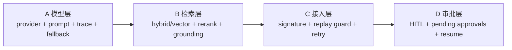

# UPGRADE3 FINAL

**版本：v0.3.0（2026-03-12）**

这份文档是升级3的最终总说明，统一描述定位、架构、流程、增强模块、验收结果与边界。

## 1. 升级3定位

升级3不是继续堆页面，而是把系统从“可跑通”收口到“可运营、可审计、可交付”：

1. 用 workflow-first 保证高约束动作可控。
2. 用 agent-assisted 提高分类/检索/摘要/建议效率。
3. 保持 OpenClaw 在 ingress/session/routing 边界内。
4. 将高风险动作纳入 HITL 审批体系。

## 2. 三个工作流

## 2.1 员工请求入口工作流

- 目标：入口消息 -> 可追踪 ticket + 可执行回复。
- 代码主路径：`workflows/support_intake_workflow.py`。
- 输入：渠道消息。
- 输出：FAQ答复或建单回执、handoff 决策、协同推送。

## 2.2 处理人员协同工作流

- 目标：通过协同命令快速推进工单处理。
- 代码主路径：`workflows/case_collab_workflow.py`。
- 输入：`/claim /reassign /escalate /resolve /close /state`。
- 输出：状态流转、审批挂起与恢复、协同事件。

## 2.3 前端工作台处理工作流

- 目标：在 Ops Console 中完成正式处理与观测。
- 代码主路径：`scripts/ops_api_server.py` + `web_console/`。
- 输入：页面动作/API调用。
- 输出：工单处理结果、队列/trace/渠道观察、知识库维护。

## 3. 四个 Agent

1. Intake Agent：入口分类与建单增强。
2. Case Copilot Agent：单工单摘要/建议/grounding。
3. Operator / Supervisor Agent：运营队列问答。
4. Dispatch / Collaboration Agent：协同调度问答与动作协作。

> 当前状态：
> - Intake/Case Copilot 已与摘要链路、检索和 trace 深度集成。
> - Operator/Dispatch Copilot 已有稳定 API 与 grounding，答案生成当前以规则化逻辑为主，后续可切换真实 LLM。

## 4. 四大增强模块

## A. 模型层

- provider abstraction + openai-compatible provider。
- fallback router。
- prompt registry + prompt version。
- llm trace metadata。

## B. 检索层

- lexical/vector/hybrid 三模式。
- rerank + source attribution。
- retrieval eval & gap report。

## C. 接入层

- signature/source validation。
- replay guard + idempotency。
- retry manager + egress observability。

## D. 审批层

- approval policy（escalate 与敏感 reassign）。
- approval runtime（pending/approve/reject/timeout）。
- handoff context 保留与恢复。

### 图1：升级3分阶段图（A/B/C/D）

说明：四个模块按基础能力到风险控制的顺序落地。

## 5. 页面 / 接口 / 状态流转映射

## 5.1 页面映射

- Dashboard：总览、风险与协同态势。
- Tickets / Ticket Detail：核心处理面板。
- Traces / Trace Detail：链路解释与问题定位。
- Queues：队列负载和优先级。
- KB：FAQ/SOP/history_case 管理。
- Channels：接入可靠性观察。

## 5.2 关键接口映射

- 工单：`/api/tickets*`、`/api/tickets/{id}/events|assist|similar-cases|grounding-sources|pending-actions`
- 动作：`/api/tickets/{id}/claim|reassign|escalate|resolve|close`
- 审批：`/api/approvals/pending`、`/api/approvals/{approval_id}/approve|reject`
- Copilot：`/api/copilot/operator|queue|ticket|dispatch/query`
- 检索：`/api/retrieval/search`、`/api/retrieval/health`
- 可观测：`/api/traces*`、`/api/channels*`、`/api/openclaw*`

## 5.3 状态流转映射（跨字段）

- 入口态：`new/pending_claim`。
- 协同态：`claimed/in_progress/handoff_requested/pending_approval`。
- 风险态：`escalated`。
- 终态：`resolved/closed`。

## 6. 测试与评测结果

## 6.1 模型层评测

- 覆盖：provider 调用、fallback、prompt registry、summary trace。
- 主要测试：`tests/unit/test_llm_*`、`tests/unit/test_prompt_registry.py`、`tests/unit/test_model_adapter.py`、`tests/unit/test_summary_engine_llm_trace.py`。

## 6.2 检索评测

- 覆盖：lexical/vector/hybrid、source attribution、retrieval eval。
- 主要测试：`tests/unit/test_retriever.py`、`tests/unit/test_retrieval_eval.py`。
- 脚本：`llm/eval/retrieval_eval.py`。

## 6.3 接入可靠性测试

- 覆盖：签名、防重放、重试、渠道路由。
- 主要测试：`tests/integration/test_channel_routing_matrix.py`、`tests/integration/test_channels_health_api.py`、`tests/regression/test_gateway_replay_guard_regression.py`。

## 6.4 HITL/审批测试

- 覆盖：审批申请、批准、拒绝、超时、恢复执行。
- 主要测试：`tests/unit/test_approval_policy.py`、`tests/unit/test_approval_runtime.py`、`tests/integration/test_ticket_actions_api.py`。

## 6.5 三个工作流验收

- Workflow 1：`tests/workflow/test_support_intake_workflow.py`
- Workflow 2：`tests/workflow/test_case_collab_workflow.py`
- Workflow 3（Ops Console/API）：`tests/integration/test_ops_api_server_smoke.py` + `web_console/tests/*`

## 6.6 四个 Agent 验证

- Intake Agent：入口分类/建单/handoff与回执。
- Case Copilot Agent：assist/similar/grounding。
- Operator Agent：operator/queue copilot 接口返回与 risk flags。
- Dispatch Agent：dispatch copilot + 协同命令一致性。

## 7. 本次版本完成情况

1. 文档体系与代码事实已对齐。
2. 三工作流、四Agent、四增强模块均有落地路径。
3. 审批闸门、链路观测、前后端联调、发布脚本已收口。

## 8. 当前项目边界

1. 不做 fully autonomous agent planner。
2. 不把 OpenClaw 变成业务规则引擎。
3. 不做多租户/RBAC 重构。
4. 不做分布式多写数据库架构（当前 SQLite）。
5. 不提供独立 progress 查询 API；当前通过会话绑定 ticket 与 `progress_query` 意图回复实现。

## 9. 下一阶段建议（不扩范围）

1. 在不改变 workflow-first 的前提下，把 Operator/Dispatch Copilot 从规则化回答平滑切到真实 LLM。
2. 继续增强 progress query 在跨会话与工单号识别场景下的体验，但保持审批与生命周期规则不下放到模型。
3. 在现有接口契约稳定后，再推进存储层升级。
